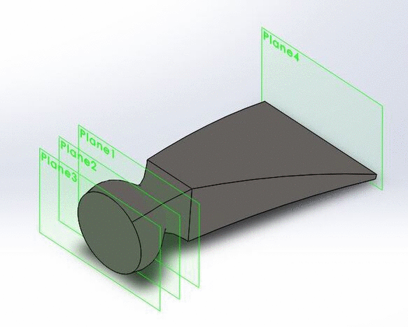
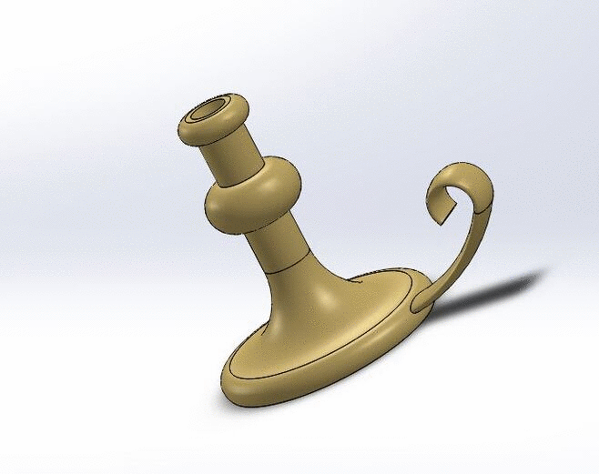
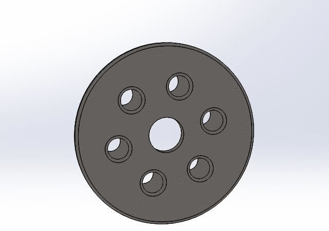
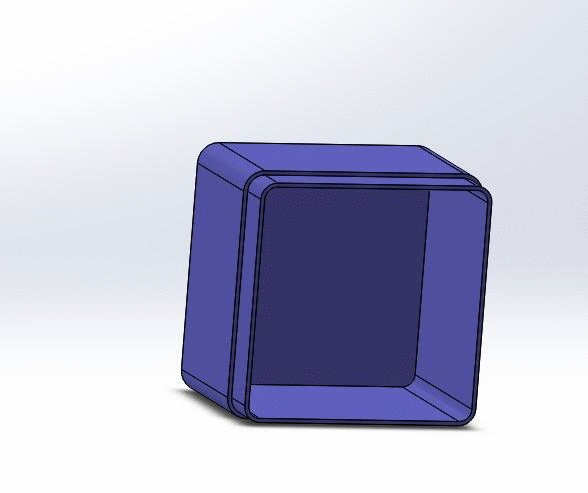
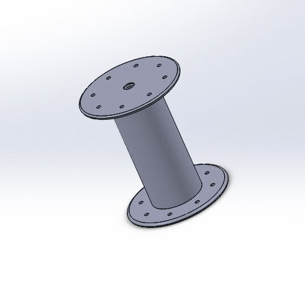
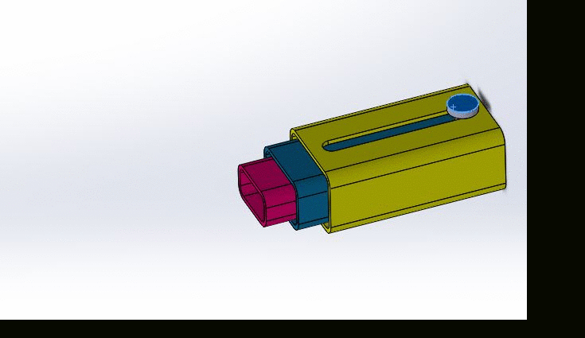

# CAD_assignments
My CAD assignments

## Not so basic CAD - Sweeps and Lofts

What it made: A candlestick and a bended nail

What I learned: How to use sweeps, revolves and lofts on SolidWorks

Struggles: I struggled with making the right planes for the second assignment, and the instructions were vague at times.

 

## Not so basic CAD - A little Practice

What it made: A box with a hole, and a wheel nut part.

What I learned: How to shell out a part to conserve resources, and how to make a circular patterned extruded base.

Struggles: I was hard to define the sketches, but this assignment wasn't very difficult.

 

## Intermediate CAD - Design Tables

What it made: Spools of six different sizes with holes in them

What I learned: How to use a circular sketch pattern, and use a design table to make different configurations of an extruded base.

Struggles: It was hard to put the right dimensions into the design table and select the right dimensions to not include in certain sizes.

## Intermediate CAD - Advanced and Mechanical Mates

What it made: Three boxes and a pin that were mated so that when you move the pin the boxes move like a telescope.

What I learned: How to mate the boxes inside themselves, how to use advanced mates, and how to use mechanical mates.

Struggles: It was hard to color the parts differently.

